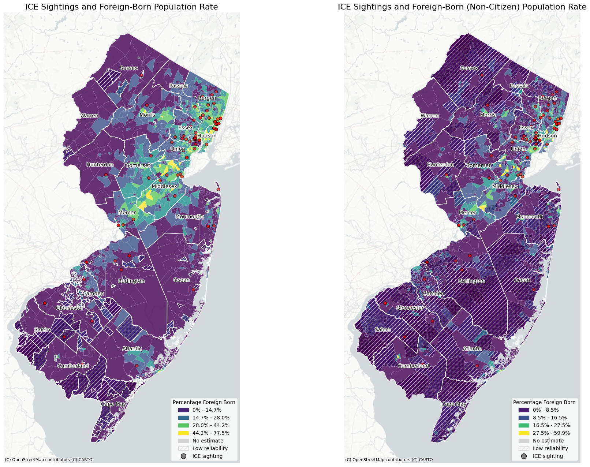
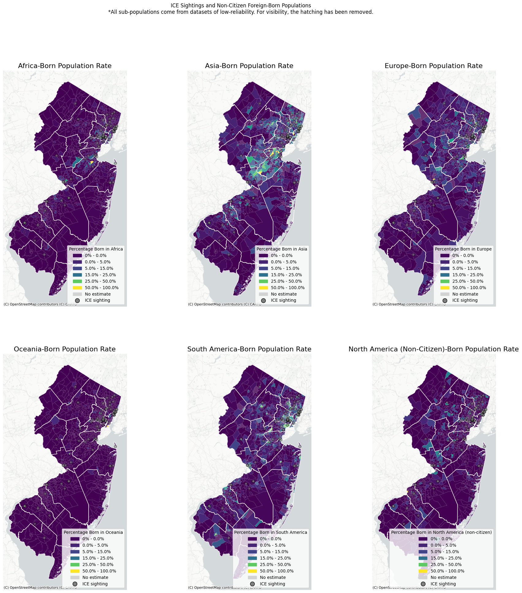

## New Jersey ICE tracker

### Here's my project tracking ICE spottings and comparing them to census data!
Made by Sean Lamb for 595 - Command Line GIS course taught by Professor Will Payne at Rutgers University

<iframe src="ICE_tracker.html" height="855" width="95%"></iframe>

### What's the source?
The source for ICE sightings is [stopice.net](https://www.stopice.net/). This site collects user-submitted ICE reports. The data is pulled in XML format, clipped to NJ and cleaned manually for any discrepencies. The source is updated daily, but the data is pulled manually for this project. This data was last updated on 12/15/2025. This information will continue to be refined and is slowly being combined with data on additional confirmed ICE raids from reputable local news sources.

The source for population data is the American Community Survey 2019 5-year estimates. These were originally downloaded in tabular form and joined to shapefiles at the tract level. Some tracts contained poor data quality estimates which are addressed by white hatching in the static maps. Data was further refined to North Jersey only using a clip function to specified North Jersey-counties.

Census Data includes the following (in each tract):\
Total Population\
*Total Foreign-Born Population (Naturalized and Non-citizens)\
*Non-citizen Foreign-Born Population\
*Non-citizen population -- European birthplace\
*Non-citizen population -- Asian birthplace\
*Non-citizen population -- African birthplace\
*Non-citizen population -- Oceanic birthplace\
*Non-citizen population -- Latin American birthplace\
*Non-citizen population -- Northern American birthplace\
*Limited-English Households\
Household Income

*This information was converted into rates against "Total Population"

  

  
  
  

  

Notice an issue? Let me know at sean.lamb@rutgers.edu!

You can explore this map [as its own web page here](ICE_tracker.html).
